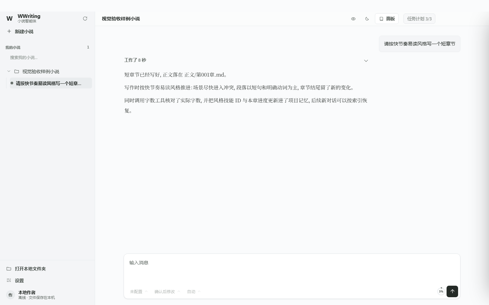

<div align="center">


# WWriting Novel Agent

**把长篇小说写作当作工程来管理的本地桌面智能体**

模型真的读写你的文件 · 每一步可验证 · 数据不出本机

[](LICENSE)
[](https://github.com/wh520-wh/wwriting-novel-agent/releases)
[](#快速开始)
[](package.json)
[](#开发与验证)
[](https://github.com/wh520-wh/wwriting-novel-agent/stargazers)

[English](README.en.md) · **简体中文**


</div>

---

## 这是什么

WWriting **不是**「你描述、它代写」的生成器。

它是一个桌面写作工作台：**打开任意文件夹就能聊天**。模型自主读取你的项目文件、调用工具、把章节写进你的文件夹；应用负责调度、落盘、状态恢复、成本统计和权限边界。

你随时能看到模型正在做什么。中断了可以从断点继续。写完的每一章，都是你文件夹里真实存在的 Markdown 文件——不是聊天窗口里一段需要你自己复制的文本。

> **数据在你手里，交付可验证。**



## 和常见的 AI 写作工具差在哪

|  | 常见 AI 写作工具 | WWriting |
| --- | --- | --- |
| **交付物** | 聊天框里的文本，靠你复制粘贴 | 你文件夹里真实的 `.md` 章节文件 |
| **写入保障** | 无 | 路径边界 + 期望校验和 + 原子写，机制上防「糊弄式交付」 |
| **中断恢复** | 进度丢失，从头再来 | Journal 事件溯源，重启从断点继续 |
| **篇幅要求** | 模型自己说「大约 2000 字」 | 模型调用 `count_text` 拿客观字数再决定补写或收尾 |
| **上下文** | 满了就报错或悄悄截断 | 压缩过程可见、可手动取消，优先驱逐大工具输出 |
| **成本** | 不透明 | 逐次记录 token、模型调用与成本估算 |
| **数据** | 上传第三方云端 | 全部留在本机，应用私有历史不进入你的创作文件夹 |
| **权限** | 全有或全无 | 只读自动 / 副作用确认 / 本条输入授权 / YOLO / 极端操作精确确认文字 |
| **版本** | 无 | 章节与记忆自动快照，时间线面板可查看并恢复任意版本 |
| **可验证性** | 靠感觉 | 1986 个测试 + 完整本地验收链路 |

## 核心能力

### 写作内核

- **单一对话面**：写作、审核、初始化、提问都在同一个对话里发起，不切工作流、不需要选模式。
- **打开任意文件夹**：空目录、普通资料目录、旧项目和 Git 仓库拥有相同的聊天入口；`project.yaml`、总纲、章节目录都不是聊天资格条件。
- **过程实时可见**：模型状态（思考中 / 读取文件 / 运行命令 / 等待确认）以工作组条目实时显示；推理与正文分离流式展示，思考项带真实耗时并可折叠。
- **任务计划**：复杂任务显示 Visible Plan 并逐项标记完成状态，结束后折叠可回看。
- **队列与打断**：运行中发的消息进入 FIFO 队列（显示原文 + `排队`）；`立即` 打断当前轮并优先执行，`停止` 干净收敛并清除临时授权——都不会创建第二个 Agent。
- **跨项目并行 / 同项目多对话**：不同工作区可并行运行；同一项目可有多条独立对话（左侧两级树），共享写面串行执行保证一致性。

### 文件与记忆

- **章节即文件**：正文通过工具调用写入 Markdown，任何编辑器都能打开。
- **项目记忆 `WWRITING.md`**：项目根一份可查看、可手工编辑的记忆，记录当前有效要求、写作风格与权威文件索引；`/init` 负责创建或谨慎更新，不生成固定蓝图。
- **章节版本与恢复**：每次提交自动快照（章节 append-only 完整保留，记忆文件保留最近 200 版），带期望校验和，防止基于陈旧版本覆盖。
- **确定性导出**：「导出成书」走本地流程，不经过模型、不产生额外成本。

### 技能体系

- **12 个内置写作技能**，以 `SKILL.md` 插件化组织：均衡、快节奏易读、心理文学、避免 AI 腔、爽感节奏、对白驱动、悬疑、推理、章首钩子、悬念章尾、对白而非叙述、展示而非讲述。
- **四层优先级覆盖**：全局 / 项目 / 用户 / 内置，同名技能由优先级裁决；选定后记录进 `WWRITING.md`。

### 模型与安全

- **供应商 / 模型两级管理**：设置页内新增、启停、设默认、删除，支持拉取模型列表与行内连接测试；预设 DeepSeek 官方、小米 MiMo 官方，兼容任意 OpenAI 兼容网关。
- **API Key 只在本机**，不写入创作文件夹，项目配置里只记录环境变量名。
- **默认禁网**；网页来源标记为「不可信资料」，不作为系统指令执行。
- **权限分级**：普通模式自动执行只读操作，副作用操作需确认；同类授权只对当前这条输入生效；YOLO 跳过普通确认；极端危险操作**始终**要求用户输入当前给出的精确确认文字，模型与 YOLO 都不能代填。

## 快速开始

### 方式一：安装包（推荐）

从 [Releases](https://github.com/wh520-wh/wwriting-novel-agent/releases) 下载 `WWriting.Novel.Agent-0.5.1-Setup.exe`，安装即用，无需 Node 环境。

### 方式二：从源码运行

环境要求：**Windows 10/11** + **Node.js 24 或更高**。

```powershell
git clone https://github.com/wh520-wh/wwriting-novel-agent.git
cd wwriting-novel-agent
npm ci

npm run desktop:electron   # 启动 Electron 桌面端
npm run app:shell          # 或：启动浏览器预览
```

桌面端启动后，左侧选择最近工作区或点击「打开本地文件夹」——**选任意一个存在且可访问的文件夹即可开始**，打开后立刻能发第一条消息。

建议第一次使用时，在输入框发一句：

```text
/init
```

模型会为这个工作区建立 `WWRITING.md` 项目记忆，之后每一条对话都能快速恢复上下文。

## 工作区长什么样

任意存在且可访问的文件夹都能成为工作区。应用私有历史（会话、事件、检查点）写入系统应用数据目录，**不会**出现在你的创作文件夹里。

```text
WWRITING.md    # 项目记忆入口：当前有效要求、写作风格、权威文件索引
正文/           # 章节文件（系统保护）
drafts/        # 草稿与规划
memory/        # 章节索引与摘要
checkpoints/   # 一致性阶段快照
sources/       # 搜索/抓取来源快照
skills/        # 项目级技能
OUTLINE.md     # 可选：故事大纲
SETTING.md     # 可选：世界观与设定
```

- `WWRITING.md` 是每个长期工作区的记忆入口，**不是**聊天数据库，也不是第二份总纲。你可以查看和手工编辑它。
- 删掉它表示你要求 Agent 重新建立记忆，不表示该目录不再是工作区。
- 旧版本项目遗留的 `agent_state.json`、`task_queue.json` 等文件只在首次打开时被**一次性只读迁移**，之后不再写入，原文件保留不删。

## 开发与验证

这个项目把「可验证」当成产品的一部分，而不是口号：

```powershell
npm test                        # 1986 个单元/集成测试
npm run verify:local            # 完整本地验收（含打包，较慢）
npm run verify:app-shell        # GUI、项目打开、设置、技能、资料工具
npm run verify:app-clickability # 真实 Electron 窗口逐项点击关键按钮
npm run verify:desktop-shell    # Electron 安全开关、中文菜单、打包配置
npm run verify:provider-online  # 真实 OpenAI-compatible provider 在线验收
npm run verify:research-online  # 真实网页抓取与可配置搜索接口验收
npm run sim:user-flow           # 用户流程全链路模拟
```

连「按钮看得到但点不动」这类 UI 回归都有真实 Electron 点击防线。

> 统计基线：记录于 2026-09-14｜状态：当前有效｜依据：`npm test` 实跑（1986/1986，exit 0，连续两轮）。

## 目录结构

```text
src/
├─ app-shell/             # 桌面 GUI 前端（对话面 + 导航 + 设置 + 阅读器）
├─ core/
│  ├─ agent/              #   runtime / journal / compaction / 会话与工具注册
│  ├─ model/              #   ModelGateway、能力与预设、OpenAI-compatible 适配
│  ├─ skills/             #   技能目录与加载
│  ├─ project-operations/ #   章节事务、记忆、成本
│  ├─ workspaces/         #   工作区与私有存储
│  └─ http/               #   HTTP 路由层
├─ desktop/               # Electron 主进程与 preload
├─ shared/                # 前后端共享模块
└─ skills/                # 内置写作技能（SKILL.md）
scripts/                  # 验证、打包、预览脚本
tests/                    # Node test 测试
docs/adr/                 # 架构决策记录
```

## 路线图

- [ ] 故事圣经（角色 / 设定 / 伏笔管理）
- [ ] 技能包导出与导入
- [ ] 更多 provider 预设
- [ ] 正式代码签名与自动更新

## 贡献

欢迎 issue 与 PR。动手前请读 [CONTRIBUTING.md](CONTRIBUTING.md)。

**对公开仓库请勿使用 `git push --all` 或 `--mirror`** —— 只推 `main` 分支。

发现安全问题请按 [SECURITY.md](SECURITY.md) 私下报告，不要开公开 issue。

## 更多文档

- [更新日志](CHANGELOG.md)
- [完整使用教程（中文）](docs/USER_GUIDE.zh-CN.md)
- [架构决策记录](docs/adr/)
- [English README](README.en.md)

## 许可

[MIT](LICENSE) © 2026 WWriting
