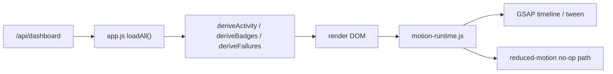

# WWriting Motion Runtime 设计规格

## 概述

本规格定义一个面向 WWriting 桌面端的前端动效层：**Motion Runtime**。它使用本地安装的 GSAP，把当前分散在 CSS class、DOM 替换和即时状态切换里的动效收敛为一组语义化 API。

Motion Runtime 的目标不是让应用更炫，而是让用户更快理解智能体状态：现在是否在工作、刚刚变化了什么、哪里需要处理、下一步入口在哪里。动效必须服务于“可信的本地写作工作台”，保持克制、可中断、可降级。

## 背景与现状

当前桌面壳位于 `src/app-shell/`，是 vanilla JS + CSS：

- `app.js` 负责状态轮询、抽屉/弹窗开合、thread 渲染和命令提交。
- `styles.css` 已有 `rise`、`pulse`、toast、busy spinner、drawer transform、reduced-motion 等 CSS 动效。
- `components/activity-strip.js` 会根据 `deriveActivity()` 重绘运行状态条。
- `components/quick-rail.js` 会根据 `deriveBadges()` 重绘右侧快捷入口和 badge。
- `components/failure-card.js` 会渲染可处理的故障卡。

这些动效能工作，但有三个问题：

1. 动效语义分散。业务代码通过 class 或 DOM 替换隐式触发动画，后续难以判断“这个动画表达什么状态”。
2. 状态变化缺少局部提示。Activity Strip、Quick Rail badge、Failure Card 更新时，用户不一定能看出是哪个信息刚变化。
3. 开合动画和焦点/点击安全没有统一约束。项目已多次强调“按钮看得到但点不动”的回归风险，任何动效都必须以点击可用性为前提。

## 设计目标

1. **状态解释优先**：动效必须解释状态变化，而不是装饰页面。
2. **本地可靠**：GSAP 通过 npm 本地依赖进入应用，不使用 CDN。
3. **小而集中**：新增一个 runtime 文件和少量调用点，不重写三栏布局，不引入框架。
4. **可降级**：尊重 `prefers-reduced-motion: reduce`，在低动效模式下保留状态更新但跳过位移、缩放和连续循环。
5. **可验证**：所有改动必须通过现有 Node 测试、app-shell 验证和真实 Electron 点击验证。

## 非目标

- 不做营销页式滚动叙事、视差、ScrollTrigger 或大面积场景动画。
- 不重写 UI 视觉系统，不更换布局，不把当前三栏工作台改成沉浸式大屏。
- 不把每一个 hover/active CSS transition 都迁移到 GSAP。
- 不新增后端 schema。第一期只消费已有 DOM 和 dashboard 派生状态。
- 不在业务组件里散写 `gsap.to()`。

## 方案比较

### 方案 A：CSS 动效微调

只调整 `styles.css`，优化 drawer、modal、toast、thread bubble 的 CSS transition。

优点：改动最小，无新增依赖。

缺点：无法协调多元素时序，状态变化前后难以比较，Activity Strip 和 Quick Rail 的局部变化仍然不明显。

### 方案 B：集中式 Motion Runtime（推荐）

新增 `src/app-shell/motion-runtime.js`，封装 GSAP，并暴露面向产品语义的函数。业务代码只调用 `motion.openDrawer()`、`motion.bumpQuickRailBadge()` 这类 API。

优点：动效语义清晰，容易统一 reduced-motion、性能、清理和测试策略；适合现有 vanilla JS 结构。

缺点：需要新增 `gsap` 依赖，并把几个现有开合/渲染点接入 runtime。

### 方案 C：沉浸式写作驾驶舱

围绕章节、成本、工具调用、审稿结果做更强的实时可视化和动态仪表。

优点：产品感强，展示效果明显。

缺点：范围过大，容易打扰写作，也会牵涉更多信息架构和数据字段。

推荐采用方案 B，并把第一期限制为 4 个高价值落点。

## 推荐设计

### 1. Motion Runtime 边界

新增文件：

```text
src/app-shell/motion-runtime.js
```

它只负责动效，不负责数据派生、不发请求、不修改业务状态。导出对象：

```js
export const motion = {
  setupMotion,
  openDrawer,
  closeDrawer,
  openModal,
  closeModal,
  insertFailureCard,
  resolveFailureCard,
  updateActivityStrip,
  bumpQuickRailBadge,
  isReducedMotion
};
```

调用方可以传 DOM 节点和轻量状态说明。runtime 不读取 `lastDashboard`，不直接调用 `renderDrawerBody()`，也不决定哪个 tab 被选中。

### 2. 依赖与加载

`package.json` 新增运行依赖，并由 `package-lock.json` 锁定实际版本：

```json
"dependencies": {
  "gsap": "^3.12.5"
}
```

前端代码不使用裸模块导入。当前浏览器端通过 `type="module"` 直接加载 `src/app-shell/app.js`，静态服务只暴露 `src/app-shell/` 和受限 `/shared/` 模块；如果写 `import { gsap } from "gsap"`，浏览器预览和 Electron 都会模块解析失败，进而导致 `app.js` 整体不执行。

第一期采用**本地 vendor 入口方案**：

```text
src/app-shell/vendor/gsap.js
```

该文件由 npm 安装的 `node_modules/gsap/dist/gsap.js` 派生，作为浏览器可直接加载的本地 ESM/UMD 包装入口。`motion-runtime.js` 只从相对路径导入：

```js
import { gsap } from "./vendor/gsap.js";
```

本期不暴露 `node_modules`，也不新增通用 `/vendor/node_modules/*` 静态路由。这样能把前端可访问面限制在 `src/app-shell/` 内，符合当前静态服务安全边界。

实现前必须先用失败测试锁定加载策略，避免引入“浏览器里模块加载失败，按钮全部不可点”的回归。测试需要同时验证 vendor 文件可 fetch、`motion-runtime.js` 可 import、Electron 页面无 module resolution console error。

### 3. Motion Tokens

在 runtime 内定义 motion token，避免每处写魔法数字：

```js
const MOTION = {
  instant: 0,
  fast: 0.14,
  base: 0.22,
  slow: 0.32,
  easeOut: "power2.out",
  easeIn: "power2.in",
  easeInOut: "power2.inOut",
  emphasis: "back.out(1.35)"
};
```

CSS 可保留现有 transition，但新增 GSAP 动效优先使用 token。第一期不引入自定义 ease 插件。

### 4. Reduced Motion 策略

runtime 使用 `window.matchMedia("(prefers-reduced-motion: reduce)")` 判断偏好。`setupMotion()` 初始化时读取一次，并监听偏好变化；每次执行动效前仍读取当前值，避免系统设置变更后状态滞后。

低动效模式下：

- 抽屉、弹窗直接完成显示/隐藏，只保留 `autoAlpha` 或 class 状态。
- Failure Card、thread message 不做位移和缩放。
- Quick Rail badge 不缩放，只更新文本和颜色。
- Activity Strip 不闪烁，只更新内容。
- 所有 timeline 仍必须调用 completion 回调，保证焦点、`inert`、`aria-hidden` 状态不丢。

### 5. 四个第一期落点

#### 5.1 Activity Strip 状态变化

当 `renderActivityStrip()` 完成 DOM 更新后，`app.js` 记录上一次 activity 摘要，并调用：

```js
motion.updateActivityStrip(stripEl, previousActivity, nextActivity);
```

runtime 比较以下字段：

- `stage`
- `chapterNo`
- `lastTool.name`
- `lastTool.status`
- `spentCost`
- `mode`

只对变化的 `.as-slot` 做短促反馈：

- `y: -2 -> 0`
- `autoAlpha: 0.75 -> 1`
- 背景色从 `--accent-soft` 或 `--red-soft` 过渡回透明

如果 `mode` 进入 `blocked` 或 `interrupted`，只强调 `.as-stage`，不让整条状态条抖动。

#### 5.2 Failure Card 插入与处理

当 `renderFailures()` 插入新卡片时，调用：

```js
motion.insertFailureCard(node);
```

进入效果：

- 卡片从 `y: 8`、`autoAlpha: 0` 到原位。
- `.failure-actions button` 使用 35ms stagger 出现。
- 不自动滚动超过现有 `insertByTs()` 的行为；滚动策略仍由业务代码控制。

当前 `syncFailureCards()` 在同一个 `failureId` 已存在时会重新渲染卡片并执行 `existing.replaceWith(renderFailureCard(...))`。第一期不要求把 Failure Card 改为原地 patch，而是让 runtime 明确支持**双节点替换过渡**。

当用户选择 action 后，业务代码先构造新的 resolved 节点，再调用：

```js
motion.resolveFailureCard(existingNode, nextNode, {
  commit: () => existingNode.replaceWith(nextNode)
});
```

处理效果：

- 旧节点中的 `.failure-actions` 淡出。
- 调用 `commit()` 完成真实 DOM 替换。
- 新节点中的 `.failure-resolved` 轻微出现。
- 卡片保留在 thread 中，作为历史记录。
- 新节点里的 diagnostics summary、复制按钮或后续可交互元素必须保持可点击。

#### 5.3 Quick Rail badge 更新

`renderQuickRail()` 目前会重建按钮。第一期不重构为 keyed patch，但需要在重绘后用前后 badge 摘要判断变化，并调用：

```js
motion.bumpQuickRailBadge(slotButton, reason);
```

`app.js` 负责保存上一次 badge summary：

```js
let previousBadgeSummary = null;
```

每次 `renderQuickRail()` 前计算新的 summary。重绘完成后，通过 `refs.quickRail.querySelector('[data-key="cost"]')` 这类稳定 key 找到新按钮，再触发 badge 动效。runtime 不依赖旧按钮节点，因为旧节点已被 `root.innerHTML = ''` 删除。

触发条件：

- 章节 `done/total` 变化。
- 成本百分比跨过 80% 或 100%。
- research/reviewer 从已读变未读。
- skills enabled 数量变化。

效果：

- badge `scale: 0.92 -> 1`，持续 160ms。
- warning/over 级别只闪一次，不持续循环。
- 图标本体最多 `y: -1 -> 0`，避免右侧栏过于活跃。

#### 5.4 抽屉与弹窗空间连续性

`openDrawer()` 和 `closeDrawer()` 保留当前可访问性模型，但需要明确“同步安全状态”和“视觉状态”分层。业务代码仍拥有 class、`inert`、`aria-hidden`、focus trap 和 lastFocused；runtime 只负责视觉过渡。

```js
motion.openDrawer(refs.drawer, refs.drawerScrim, {
  body: refs.drawerBody,
  tabs: refs.drawerTabs
});
```

打开顺序：

1. 业务代码同步设置：drawer 移除 `inert`，`aria-hidden=false`，添加 `.show`，scrim 添加 `.show`。
2. 业务代码渲染 drawer body 并设置焦点。
3. runtime 执行 scrim `autoAlpha: 0 -> 1`、drawer `xPercent: 100 -> 0`、drawer head/tabs/body 轻微 stagger。

关闭顺序必须优先保证可点击安全：

1. 业务代码同步设置 drawer/scrim 的 `data-closing="true"`。
2. scrim 立即进入不可截获点击状态：移除 `.show` 或设置 `pointer-events: none`。本项目优先沿用当前做法：立即移除 scrim `.show`。
3. drawer 立即设置 `aria-hidden=true` 和 `inert`，让 Tab/focus trap 不再进入关闭中的面板。
4. runtime 对已进入关闭状态的 drawer 做反向视觉动画。该动画不得依赖元素仍可聚焦或可点击。
5. 关闭动画完成后清理 `data-closing` 和临时 transform/opacity，并恢复 `lastFocused`。如果用户在关闭过程中再次按 Esc，不得报错。

这意味着关闭动画是“视觉尾声”，不是交互状态。交互状态必须立即关闭，避免遮罩或焦点陷阱残留。

设置弹窗、创建小说弹窗可共用：

```js
motion.openModal(scrim, panel);
motion.closeModal(scrim, panel);
```

modal 使用 `y: 8` 和 `scale: 0.985`，不做弹跳，保持桌面工具感。

## 数据流



关键顺序：

1. 业务代码先完成真实 DOM 状态和 aria 状态。
2. Motion Runtime 只在 DOM 已存在后做视觉过渡。
3. 动效失败不得阻断功能；runtime 函数需要捕获异常并安全返回。
4. 对于替换式渲染，业务代码先创建 next DOM，runtime 接收 old/new 节点并在安全时机执行 commit。

## 交互与无障碍

- 所有 icon-only button 保持 `aria-label`。
- 动效期间不可禁用用户取消能力。Esc 关闭仍然即时有效。
- 抽屉和 modal 的 focus trap 逻辑由现有代码保留。
- GSAP 不得设置会导致元素不可点击的长期 `pointer-events: none`。
- 使用 `autoAlpha` 时必须确认隐藏态不会覆盖点击区域。
- 动效完成后只清理临时 `transform` 和临时 `opacity`。`visibility`、`pointer-events`、`inert`、`aria-hidden` 由业务 class/CSS/DOM 属性控制，runtime 不在清理阶段擅自恢复。

## 性能约束

- 只动画 `x`、`y`、`scale`、`autoAlpha`。如需动画 CSS custom property，仅限单个小元素上的局部变量，不动画 `:root` 或影响大面积布局/重绘的变量。
- 不动画 `width`、`height`、`top`、`left`、`margin`、`padding`。
- 不给大量元素统一加 `will-change`。只在 `.drawer`、modal panel、`.failure-card`、`.qr-badge` 等少数元素上按需声明。
- 不创建常驻 timeline。所有一次性 timeline 完成后自动释放。
- 重复状态轮询不得每次都触发动效。必须有 previous/next diff。

## 错误处理

`motion-runtime.js` 内部提供安全包装：

```js
function safeAnimate(fn) {
  try {
    return fn();
  } catch (error) {
    console.warn("[motion]", error);
    return null;
  }
}
```

如果 GSAP 加载失败，应用不应白屏。实施计划需要包含静态加载验证，确保失败能被测试捕捉。运行时不要求动态 fallback 到 CSS 动效；加载失败属于构建/服务配置错误，应由验证命令挡住。

## 测试与验证

最低验证集：

```powershell
npm test
npm run verify:app-shell
npm run verify:app-clickability
npm run verify:desktop-shell
npm run verify:electron-runtime
```

新增或调整测试应覆盖：

1. Motion Runtime 在 reduced-motion 下不会创建位移/缩放动效。
2. Activity Strip 只有字段变化时才触发 slot 动效。
3. Quick Rail badge 变化能被 diff 识别。
4. Failure Card 插入后 action button 仍可点击。
5. Failure Card resolved 替换后 diagnostics 和剩余交互元素仍可点击。
6. 抽屉开关后 `aria-hidden`、`inert` 和焦点恢复正确。
7. app-shell 静态服务能提供 GSAP 本地 vendor 文件。
8. Electron 页面能成功 import `motion-runtime.js`，并且 console 中没有模块解析失败、MIME 错误或未捕获 promise rejection。

## 分阶段交付

### Phase 1：Runtime 与加载安全

- 安装本地 GSAP。
- 新增 `motion-runtime.js`。
- 新增 `src/app-shell/vendor/gsap.js` 本地入口。
- 加入 reduced-motion、safeAnimate 和 token。
- 加载策略通过测试锁定。

### Phase 2：高价值状态反馈

- 接入 Activity Strip diff 动效。
- 接入 Failure Card 插入/处理动效。
- 接入 Quick Rail badge diff 动效。

### Phase 3：空间连续性

- 接入 drawer open/close timeline。
- 接入 settings/create modal timeline。
- 保持 focus、inert、aria-hidden、Esc 行为不变。

### Phase 4：验证与收敛

- 跑完整验证集。
- 删除被 GSAP 取代且重复的 CSS 动效。
- 保留必要 CSS transition 作为基础交互反馈。

## 验收标准

- 用户能通过轻微动效看出 Activity Strip 哪个槽位刚变化。
- 新 Failure Card 出现和处理状态有明确但不打扰的反馈。
- Quick Rail 的章节、成本、资料、审查 badge 更新能被注意到。
- 抽屉和弹窗开合有空间连续性，且不破坏点击、焦点、Esc、隐私模式。
- reduced-motion 下应用仍完整可用，且不出现位移、缩放、循环闪烁。
- 不使用 CDN，不依赖网络加载前端动效。
- Electron 真实页面能成功加载 `motion-runtime.js`，没有 GSAP 模块解析错误。
- `npm test`、`npm run verify:app-shell`、`npm run verify:app-clickability`、`npm run verify:desktop-shell`、`npm run verify:electron-runtime` 通过。

## 风险与缓解

| 风险 | 缓解 |
|---|---|
| 裸模块导入在静态预览中失败 | 先写加载验证；必要时使用本地 vendor 路径 |
| 动效期间遮罩截获点击 | 关闭时立即关闭交互状态，动画只做视觉尾声；跑 clickability |
| 轮询导致重复动画 | previous/next diff，只对变化字段触发 |
| 动效压过写作专注感 | 限制第一期为四个状态动效；时长 120-320ms |
| GSAP inline style 覆盖 CSS | timeline 完成后清理临时 transform/opacity |
| reduced-motion 分支漏掉 completion | no-op path 也必须执行完成回调 |

## 实施边界

第一期实施只允许触碰：

- `package.json`
- `package-lock.json`
- `src/app-shell/vendor/gsap.js`
- `scripts/serve-app-shell.mjs` 或相关静态服务测试文件（仅用于验证，不新增 node_modules 暴露路由）
- `src/app-shell/app.js`
- `src/app-shell/styles.css`
- `src/app-shell/motion-runtime.js`
- `src/app-shell/components/activity-strip.js`
- `src/app-shell/components/quick-rail.js`
- `src/app-shell/components/failure-card.js`
- `tests/*.test.mjs`
- `scripts/verify-app-clickability.cjs`（仅当选择器需要同步更新）

不触碰 agent engine、provider、写作状态机、项目文件 schema。
